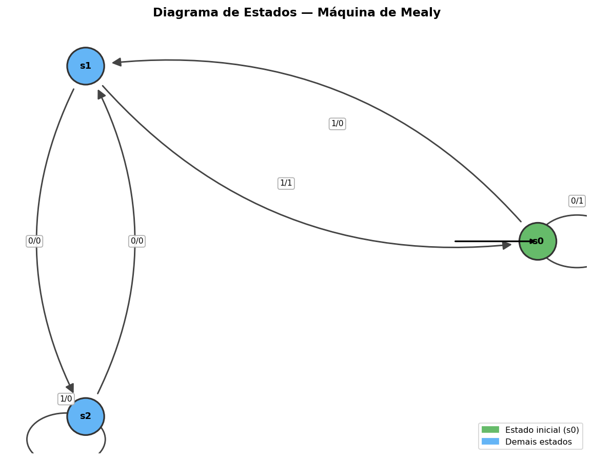

## Sobre o projeto

Uma **Máquina de Mealy** é um modelo computacional (autômato finito com saída) em que a saída depende tanto do estado atual quanto do símbolo de entrada. Este projeto permite:

- Carregar a definição de uma máquina a partir de um arquivo JSON
- Simular a execução da máquina para qualquer cadeia de entrada
- Exibir as tabelas de transição (δ) e de saída (λ) formatadas no terminal
- Gerar automaticamente o diagrama de estados como imagem PNG

Desenvolvido por **João Victor Pereira Couto**

---

## Funcionalidades

| Funcionalidade | Descrição |
|---|---|
| Simulação | Processa uma cadeia de entrada passo a passo, exibindo cada transição |
| Tabela de Transição δ | Mostra o próximo estado para cada par (estado, entrada) |
| Tabela de Saída λ | Mostra o símbolo gerado para cada par (estado, entrada) |
| Diagrama de estados | Gera um grafo dirigido da máquina salvo em PNG |

---

## Requisitos

- Python 3.12+
- [matplotlib](https://matplotlib.org/)
- [networkx](https://networkx.org/)

Instale as dependências:

```bash
pip install matplotlib networkx
```

---

## Uso

### 1. Defina a máquina em JSON

Crie um arquivo `.json` com a seguinte estrutura:

```json
{
  "S": ["s0", "s1", "s2"],
  "I": ["0", "1"],
  "O": ["0", "1"],
  "f": {
    "s0": { "0": "s0", "1": "s1" },
    "s1": { "0": "s2", "1": "s0" },
    "s2": { "0": "s1", "1": "s2" }
  },
  "g": {
    "s0": { "0": "1", "1": "1" },
    "s1": { "0": "0", "1": "0" },
    "s2": { "0": "0", "1": "0" }
  },
  "s_ini": "s0"
}
```

| Campo | Descrição |
|---|---|
| `S` | Lista de estados |
| `I` | Alfabeto de entrada |
| `O` | Alfabeto de saída |
| `f` | Função de transição δ(estado, entrada) → próximo estado |
| `g` | Função de saída λ(estado, entrada) → símbolo de saída |
| `s_ini` | Estado inicial |

### 2. Execute o simulador

```bash
python3 main.py
```

O programa solicitará o nome do arquivo JSON. Ao carregar, exibirá automaticamente as tabelas e gerará o diagrama de estados (`grafo_mealy.png`).

### 3. Menu interativo

```
==========================================
 [1] Simular cadeia de entrada
 [2] Exibir tabelas de transição/saída
 [3] Gerar diagrama de estados (PNG)
 [s] Sair
==========================================
```

---

## Exemplo de saída

**Tabelas geradas para `maquina.json`:**

```
┌─────────────────────────────────────────┐
│  Tabela de Transição  δ(estado, entrada) │
└─────────────────────────────────────────┘
Estado   |   0    |   1
---------------------------
*s0      |   s0   |   s1
 s1      |   s2   |   s0
 s2      |   s1   |   s2

┌─────────────────────────────────────────┐
│  Tabela de Saída  λ(estado, entrada)     │
└─────────────────────────────────────────┘
Estado   |   0    |   1
---------------------------
*s0      |   1    |   1
 s1      |   0    |   0
 s2      |   0    |   0

  (* = estado inicial: s0)
```

**Simulação da cadeia `101`:**

```
--- Simulação da Máquina de Mealy ---
Estado inicial: s0
Entrada: 101

(s0, 1) -> (s1, 1)
(s1, 0) -> (s2, 0)
(s2, 1) -> (s2, 0)

Estado final: s2
Saída: 100
```

**Diagrama de estados gerado:**



---

## Estrutura do projeto

```
.
├── main.py          # Código principal
├── maquina.json     # Exemplo de definição de máquina
├── grafo_mealy.png  # Diagrama gerado automaticamente
└── README.md
```

---

## Licença

Projeto acadêmico — uso livre para fins educacionais.
